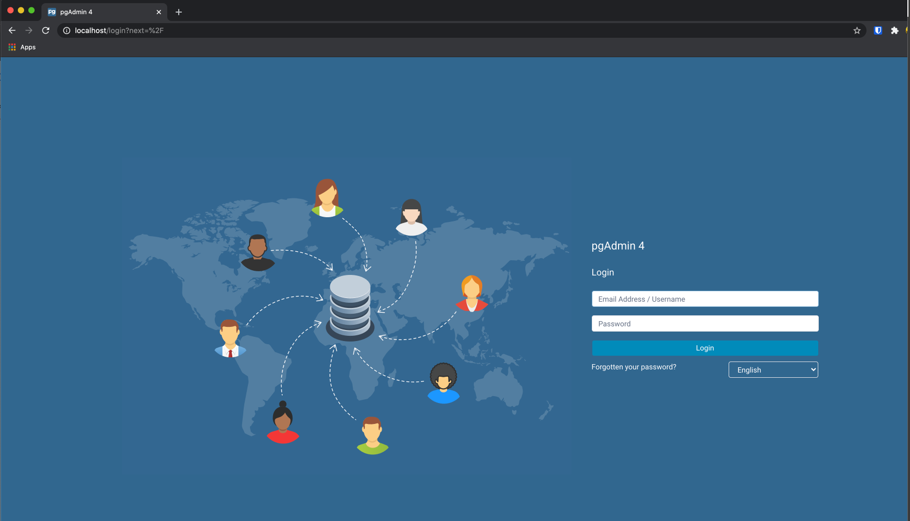

# postgres-scratch
Scratchpad for postgres.

# WARNING!!! NEVER, EVER, EVER use this in production. You're gonna have a bad time.

For example all the secrets are in the form of environment variables which are in the vcs in the .env file.

## Repo structure

```
.
├── .env                            # contains the environment variables
├── Dockerfile                      # dockerfile for postgres client
├── LICENSE
├── Makefile                        # your main point of interaction
├── README.md
├── docker-compose.yml              # yml file for services
├── images
│   └── admin.png
├── scripts
│   ├── docker-entrypoint.sh
│   ├── kill_all_the_things.sh      # be very careful with this, it will wipe all your containers and images
│   └── start.sh                    # start postgres
└── sql                             # folder containing all the sql we cover in the tutes
    ├── data.sql                
    ├── clean.sql
    └── schema.sql

```


## Requirements:

You need the following installed:

* docker
* docker-compose
* bash
* make


# Installation

## Downloading the repository:

```bash
# Clone repository:
git clone git@github.com:Chumbaloo/postgres-scratch.git

# OR

git clone https://github.com/Chumbaloo/postgres-scratch.git
```

## Building (Should only be done once):

```bash
# build
make build
```


# Usage

## A simple postgres environment

```bash
# debug
make debug

# start postgres
root@<containerID>:/app# ./scripts/start.sh

postgres=\#  

```

## Using PgAdmin

```bash

# admin
make admin

# then access through web browser at http://localhost:80
# the admin creds are in .env
```




## Cleanup:

```bash

make down

```


